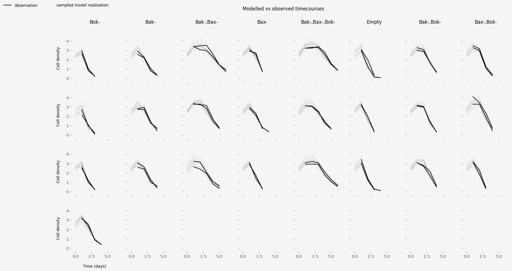
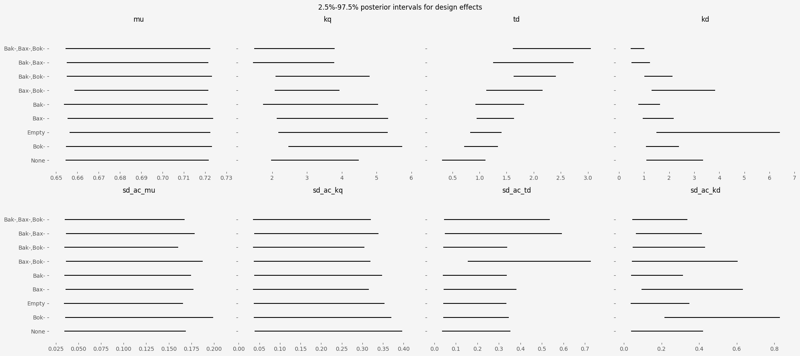

# Statistical report

This document sets out our statistical model's assumptions, explains its
implementation and presents the results.

## Model assumptions

The aim of this analysis is to describe timecourse data about the density of
CHO cell cultures that were given treatments that induce cell death. Some
cultures were given genetic interventions that aim to make them
apoptosis-resistant, either by reducing the rate at which they die or by
extending the period before they start to die. We would like to know which
interventions have the most effect, and in what way.

### Assumptions about the target system

We assume that in this scenario the cells exist in four states:

- $R$ replicative, growing at a rate of $\mu R(t)$, where t is the current time
  and $R(t)$ is the current density of replicative cells
- $Q_a$ growth arrest, transferring from normal at a rate of $k_q R(t)$
- $Q_c$ death committed, transferring from growth arrest at a rate of $k_q
  R(t-\tau)$, where $tau > 0$ represents the delay between growth arrest
  and death commitment.
- dead, transferring from death committed at a rate of $k_d Q_c(t)$, where
  $Q_c(t)$ is the density of death-committed cells at time $t$.

These assumptions define a system of ordinary differential equations
(specifically "delay differential equations") that can be solved analytically,
so that the density at a given time can be found as a function of the
parameters $\mu$, $\tau$ $k_q$, $k_d$ and the initial density of replicative cells
$R0$.

We have measurements of the total cell volume, i.e. $R(t) + Q_a(t) + Q_c(t)$ at
several time points, for cell cultures with the following structure:

- 9 genetic designs, comprising 7 genetic interventions and two control
  designs.
- Between 1 and 4 clones implementing each design
- Two technical replicates for each clone.

Replicates of the same clone are biologically identical, though we expect some
variation in measurements due to the experimental conditions. Clones with the
same design are expected to be similar, with some degree of clonal variation
that may differ depending on the design. There is no prior information
distinguishing the designs from each other, or distinguishing clones with the
same design.

Given these assumptions a multi-level Bayesian statistical model is
appropriate. 

### Multilevel model structure

We used the following measurement model:

$$
y \sim lognormal(\log(\hat{y}(t, R0, \mu, \tau_r, k_{qr}, k_{dr})), \sigma)
$$

where 

- $R0$, $\tau_r$, $k_{qr}$ and $k_{dr}$ are vectors of replicate-level
  parameters
- $\mu$ is an unknown number representing the pre-treatment growth rate, which
  we assume is the same for all replicates.
- $\sigma$ is an unknown log-scale error standard deviation
- $t$ is a vector of known measurement times (one per measurement) 
- $\hat{y}$ is a function mapping parameter configurations to densities, under
  the delay differential equation assumptions laid out above

The parameters $\tau_r$, $k_{qr}$ and $k_{dr}$ vectors are treated as
compounds of a global mean and design and clone level residuals, i.e.

\begin{align*}
\tau_r &= \alpha_\tau + \beta_\tau + \gamma_\tau \\
k_{qr} &= \alpha_q + \beta_q + \gamma_q \\
k_{dr} &= \alpha_d + \beta_d + \gamma_d 
\end{align*}

where the $\alpha$ parameters are global means, the $\beta$s are design-level
residuals and the $\gamma$s are clone-level residuals.

In order to accommodate uncertainty as to the level of clonal variation, we use
hierarchical prior distributions for the clone level parameters, e.g.

$\gamma_{\tau} \sim normal(0, sd_{\tau})$

Other unkowns have informative prior distributions based on scientific
knowledge.

## Results

### Observed vs modelled timecourses

Figure 1. shows observed timecourses for each design under the 15ug/mL
puromycin treatment, alongside a sample of model-realised timecourses. The
modelled and observed timecourses appear qualitatively similar, suggesting that
the model is not dramatically mis-specified.

### Posterior distributions of design parameters

Figure 2. plots the 2.5% to 97.5% marginal posterior intervals for the
design-level parameters, relative to the control experiment. According to our
model, some designs are probably different from the control with respect to the
$\tau$ and $k_d$ parameters. On the other hand, all of the posterior intervals
for design-specific effects on the parameter $k_q$ include zero, showing that
the designs cannot conclusively be distinguished using the data provided.

